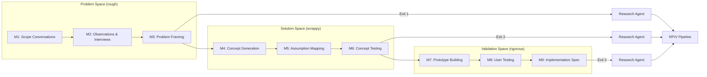

# Design Thinking Guide

> Adapted from [microsoft/hve-core](https://github.com/microsoft/hve-core) — a three-space, nine-method Design Thinking framework for human-centered discovery.

## Overview

Design Thinking (DT) is an **optional pre-Research activity** in the soft-factory RPIV pipeline. It provides structured human-centered discovery for workitems where the problem is not yet well understood — before technical research begins.

The framework organizes discovery into **three spaces** with **nine methods**:

| Space | Methods | Fidelity | Purpose |
|-------|---------|----------|---------|
| **Problem** | Methods 1–3 | Rough / Exploratory | Understand the real problem before jumping to solutions |
| **Solution** | Methods 4–6 | Scrappy / Concept-grade | Generate and test solution concepts with minimal investment |
| **Validation** | Methods 7–9 | Functionally rigorous | Validate that the solution works for real users in real conditions |

Each space has an **exit point** where you can hand off to the RPIV pipeline's Research agent. The later you exit, the more refined your input to the pipeline.

## Three-Space Flow

## Method Overview

| # | Method | Space | Key Output |
|---|--------|-------|------------|
| 1 | Scope Conversations | Problem | Stakeholder landscape, initial problem boundaries |
| 2 | Observations & Interviews | Problem | User needs, pain points, contextual insights |
| 3 | Problem Framing | Problem | Validated problem statement, "How Might We" questions |
| 4 | Concept Generation | Solution | Solution concepts, design alternatives |
| 5 | Assumption Mapping | Solution | Prioritized assumptions, risk assessment |
| 6 | Concept Testing | Solution | Tested concepts, validated/invalidated assumptions |
| 7 | Prototype Building | Validation | Functional prototypes for user testing |
| 8 | User Testing | Validation | User feedback, usability findings |
| 9 | Implementation Spec | Validation | Functional specification with test evidence |

## Integration with RPIV

Design Thinking is **upstream** of the RPIV pipeline — it feeds into the Research stage, never replaces it. See [DT-RPIV Integration Contract](dt-rpiv-integration.md) for the full integration specification.

**Three exit points** determine how DT output shapes Research agent behavior:

| Exit Point | After Method | What Research Agent Receives |
|------------|-------------|------------------------------|
| Exit 1 | Method 3 (Problem Framing) | Validated problem statement — research scopes around stakeholder-validated needs |
| Exit 2 | Method 6 (Concept Testing) | Validated concept + constraints — research narrows to tested directions |
| Exit 3 | Method 9 (Implementation Spec) | Functional spec + test evidence — research focuses on production readiness |

All handoff artifacts include [confidence markers](../architecture/core-components/CORE-COMPONENT-0002-confidence-markers.md) (`validated`, `assumed`, `unknown`, `conflicting`) so the Research agent knows which findings to trust and which to investigate further.

## Getting Started

1. **Determine if you need DT** — see [Why Design Thinking?](why-design-thinking.md) for trigger and skip conditions.
2. **Start a DT session** — use the [DT Coach agent](dt-coach.md) to guide your team through the methods.
3. **Hand off to RPIV** — follow the [Handoff Tutorial](tutorial-handoff-to-rpiv.md) when you reach an exit point.
4. **Understand the mapping** — see [DT-RPIV Mapping](dt-rpiv-mapping.md) for the authoritative terminology and contract reference.

## Documentation

| Document | Purpose |
|----------|---------|
| [Why Design Thinking?](why-design-thinking.md) | When and why to use DT before RPIV |
| [DT Coach Guide](dt-coach.md) | How to use the DT Coach agent |
| [DT-RPIV Integration](dt-rpiv-integration.md) | The integration contract between DT and RPIV |
| [Handoff Tutorial](tutorial-handoff-to-rpiv.md) | Step-by-step guide for handing off from DT to RPIV |
| [DT-RPIV Mapping](dt-rpiv-mapping.md) | Authoritative terminology and exit-point contract reference |

## HVE-Core Method Guides (External References)

The detailed method guides live in the [microsoft/hve-core](https://github.com/microsoft/hve-core) repository. These are referenced rather than copied to avoid content drift (see [ADR-0002](../architecture/ADR/ADR-0002-adopt-hve-design-thinking.md), Option C strategy).

| Method | Guide |
|--------|-------|
| Method 01: Scope Conversations | [method-01-scope-conversations.md](https://github.com/microsoft/hve-core/blob/main/docs/design-thinking/method-01-scope-conversations.md) |
| Method 02: Observations & Interviews | [method-02-observations-interviews.md](https://github.com/microsoft/hve-core/blob/main/docs/design-thinking/method-02-observations-interviews.md) |
| Method 03: Problem Framing | [method-03-problem-framing.md](https://github.com/microsoft/hve-core/blob/main/docs/design-thinking/method-03-problem-framing.md) |
| Method 04: Concept Generation | [method-04-concept-generation.md](https://github.com/microsoft/hve-core/blob/main/docs/design-thinking/method-04-concept-generation.md) |
| Method 05: Assumption Mapping | [method-05-assumption-mapping.md](https://github.com/microsoft/hve-core/blob/main/docs/design-thinking/method-05-assumption-mapping.md) |
| Method 06: Concept Testing | [method-06-concept-testing.md](https://github.com/microsoft/hve-core/blob/main/docs/design-thinking/method-06-concept-testing.md) |
| Method 07: Prototype Building | [method-07-prototype-building.md](https://github.com/microsoft/hve-core/blob/main/docs/design-thinking/method-07-prototype-building.md) |
| Method 08: User Testing | [method-08-user-testing.md](https://github.com/microsoft/hve-core/blob/main/docs/design-thinking/method-08-user-testing.md) |
| Method 09: Implementation Spec | [method-09-implementation-spec.md](https://github.com/microsoft/hve-core/blob/main/docs/design-thinking/method-09-implementation-spec.md) |

## Confidence Markers

All DT handoff artifacts use confidence markers defined in [CORE-COMPONENT-0002](../architecture/core-components/CORE-COMPONENT-0002-confidence-markers.md). These markers indicate the epistemic status of each finding:

| Marker | Meaning |
|--------|---------|
| `validated` | Confirmed through multi-source evidence or direct verification |
| `assumed` | Believed true but not independently verified |
| `unknown` | Identified gap that has not yet been investigated |
| `conflicting` | Evidence from multiple sources points in different directions |

---

*Adapted from [microsoft/hve-core](https://github.com/microsoft/hve-core) Design Thinking framework. See [ADR-0002](../architecture/ADR/ADR-0002-adopt-hve-design-thinking.md) for the adoption decision.*
