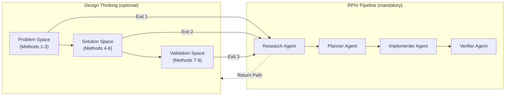

# DT-RPIV Integration Contract

> Adapted from [microsoft/hve-core](https://github.com/microsoft/hve-core) — the authoritative specification for how Design Thinking integrates with the soft-factory RPIV pipeline.

## Overview

Design Thinking (DT) is an **optional upstream activity** that feeds into the mandatory RPIV pipeline (Research → Plan → Implement → Verify). This document defines the integration contract: how DT output enters RPIV, how each agent uses DT findings, and how RPIV can return to DT when needed.



## Three Exit Points

DT has three natural exit points, one after each space. **All exits enter RPIV at the Research stage** — regardless of how much DT work was done. The exit point determines what the Research agent receives and how it adjusts its scope.

### Exit Point 1: Problem Statement Complete (after Methods 1–3)

**When to use:** The problem is now clearly framed, but no solution concepts have been explored yet.

**DT output:**
- Validated problem statement
- Stakeholder map with needs and priorities
- "How Might We" questions
- Findings tagged with confidence markers

**Research agent behavior:**
- Scopes technical research around stakeholder-validated needs
- Treats `assumed` items as verification targets
- Treats `unknown` items as primary research targets
- Explores solution approaches based on the problem framing

### Exit Point 2: Concept Validated (after Methods 4–6)

**When to use:** A solution concept has been tested and validated (or invalidated), but no functional prototype exists.

**DT output:**
- Validated (or invalidated) solution concepts
- Assumption map with test results
- Constraint list (technical, organizational, user-facing)
- Findings tagged with confidence markers

**Research agent behavior:**
- Narrows research scope to tested directions
- Resolves constraint gaps identified during concept testing
- Assesses technical feasibility of the validated concept
- Treats invalidated concepts as out-of-scope (does not re-investigate)

### Exit Point 3: Implementation Spec Ready (after Methods 7–9)

**When to use:** A functional prototype has been tested with real users, and a detailed implementation specification exists.

**DT output:**
- Functional specification
- User testing evidence
- Implementation constraints and requirements
- Findings tagged with confidence markers

**Research agent behavior:**
- Investigates production readiness, scaling gaps, and integration concerns
- Research scope is significantly narrowed — most problem and solution questions are already answered
- Focuses on technical depth rather than breadth

## Per-Agent Input Mapping

### Research Agent

| Aspect | Standard Behavior (no DT) | DT-Informed Behavior |
|--------|---------------------------|----------------------|
| Input source | User request or workitem description | `docs/workitems/<WI-ID>/artifacts/dt-handoff.md` |
| Problem understanding | Must discover the problem from scratch | Problem is pre-framed by DT; research validates and extends |
| Scope | Broad exploration | Scoped by DT exit point (narrower with higher exit points) |
| Confidence handling | All claims start as `assumed` | Inherits confidence markers from DT handoff; `validated` items don't need re-investigation |
| Key task | Define the problem and solution space | Validate DT findings technically, fill gaps, assess feasibility |

### Planner Agent

| Aspect | Standard Behavior (no DT) | DT-Informed Behavior |
|--------|---------------------------|----------------------|
| Input source | Research brief (`00-research.md`) | Research brief enriched with DT-originated confidence markers |
| Task scoping | Based on research findings alone | Benefits from stakeholder-validated priorities and tested concepts |
| Risk handling | Identifies risks from research | Inherits risk assessment from DT assumption mapping; focuses on technical risks |
| `conflicting` items | Escalates to Research stage | May escalate to DT coaching if conflict is stakeholder-based rather than technical |

### Implementer Agent

| Aspect | Standard Behavior (no DT) | DT-Informed Behavior |
|--------|---------------------------|----------------------|
| Input source | Task breakdown from Plan stage | Same, but tasks may reference DT findings as context |
| Design decisions | Based on technical judgment | Informed by DT concept testing and user feedback |
| `unknown` items | Flags in implementation notes | Same — DT does not resolve all unknowns; some become research/implementation targets |
| User-facing work | Based on requirements | Benefits from DT user testing evidence (Exit 3) |

### Verifier Agent

| Aspect | Standard Behavior (no DT) | DT-Informed Behavior |
|--------|---------------------------|----------------------|
| Input source | Implementation output | Same |
| Verification scope | Tests pass, PR is clean | Same — Verify is unchanged by DT |
| `conflicting` items | Checks that none remain unresolved | Same — checks research brief and DT handoff artifact |
| Quality assessment | Runs test suite, creates commits, opens PR | Same — **Verify runs tests and opens PR, not coaching assessment** |

## Confidence Markers

DT handoff artifacts use [confidence markers](../architecture/core-components/CORE-COMPONENT-0002-confidence-markers.md) to tag every finding. These markers propagate through the RPIV pipeline:

| Marker | In DT Handoff | In Research Brief | In Plan/Implement |
|--------|--------------|-------------------|-------------------|
| `validated` | Confirmed by DT methods (user interviews, concept testing, etc.) | Carried forward; no re-investigation needed | Treated as reliable input |
| `assumed` | Believed true based on DT observations but not independently verified | Verification target — research should confirm or invalidate | Implementation proceeds with documented assumption |
| `unknown` | Gap identified during DT but not investigated | Primary research target | Must be resolved before dependent work proceeds |
| `conflicting` | DT found contradictory evidence from different stakeholders or sources | Must be resolved in research; escalation to DT coaching if stakeholder-based | Must not proceed until resolved |

### Marker Lifecycle Example

```
DT Session:     "Operators prefer tablet interface" [assumed]
Research Agent:  Confirms via usability study → upgrades to [validated]
Planner Agent:   Plans tablet-first UI tasks based on [validated] finding
Implementer:    Implements tablet-optimized layout
```

```
DT Session:     "API supports batch operations" [assumed]
Research Agent:  Finds API docs contradict → escalates to [conflicting]
Planner Agent:   Cannot create dependent tasks → escalates to Research
Research Agent:  Resolves by testing API directly → [validated] or redesigns approach
```

## Iteration Support: Return Path (RPIV → DT)

The RPIV pipeline can return to DT coaching when the `research` agent discovers that DT assumptions need revision. This is **designed behavior, not failure**.

### When to Return to DT

| Condition | Example | Return Target |
|-----------|---------|---------------|
| Problem statement needs revision | Research reveals the problem is different from what DT concluded | DT Method 3 (Problem Framing) |
| Fundamental assumptions invalidated | Technical investigation proves a core DT assumption wrong | DT Method 5 (Assumption Mapping) |
| New stakeholder groups emerge | Research discovers affected users that DT didn't include | DT Method 1 (Scope Conversations) |

### Return Path Process

1. The `research` agent documents the reason for return in the research brief with a `conflicting` confidence marker.
2. The `research` agent recommends returning to DT coaching, specifying which method to revisit.
3. The `dt-coach` agent resumes the session from the recommended method, reading the research brief for new context.
4. When DT reaches a new exit point, it produces an updated handoff artifact.
5. The `research` agent resumes with the updated DT output.

## Verify ≠ Review

**Important distinction:** soft-factory's Verify stage is **not** a DT-style coaching quality assessment.

| Verify (soft-factory) | Review (DT coaching assessment) |
|------------------------|----------------------------------|
| Runs the test suite | Evaluates coaching quality |
| Creates commits following Conventional Commits | Assesses whether DT methods were followed correctly |
| Opens a PR assigned to Copilot for review | Provides feedback on facilitation technique |
| Binary outcome: tests pass or fail | Qualitative assessment of discovery depth |

DT artifact quality is validated **within pipeline stages**:
- The `research` agent validates that the DT handoff is complete and actionable.
- The `planner` agent validates that DT findings are sufficient for task creation.
- The `verifier` agent checks that no `conflicting` items remain unresolved.

There is no separate "DT Review" stage in the pipeline.

## Handoff Artifact Structure

The DT Coach produces a handoff artifact at `docs/workitems/<WI-ID>/artifacts/dt-handoff.md` (per [ADR-0003](../architecture/ADR/ADR-0003-dt-artifact-storage.md)) with the following structure:

```markdown
# DT Handoff: <WI-ID>

## Exit Point
Exit <1|2|3> — <description>

## Findings
- Finding 1 `[validated]` — evidence source
- Finding 2 `[assumed]` — basis for assumption
- Finding 3 `[unknown]` — what needs investigation

## Scope Boundaries
- In scope: ...
- Out of scope: ...

## Unresolved Questions
- Question 1 — `[unknown]`
- Question 2 — `[conflicting]` — source A says X, source B says Y

## Recommendations for Research Agent
- Focus areas for technical research
- Specific validation targets for `[assumed]` items
```

## Related Documents

- [Design Thinking Guide](README.md) — Overview of the framework
- [Why Design Thinking?](why-design-thinking.md) — When and why to use DT
- [DT Coach Guide](dt-coach.md) — How to use the DT Coach agent
- [Handoff Tutorial](tutorial-handoff-to-rpiv.md) — Step-by-step handoff walkthrough
- [DT-RPIV Mapping](dt-rpiv-mapping.md) — Authoritative terminology and contract reference
- [ADR-0002](../architecture/ADR/ADR-0002-adopt-hve-design-thinking.md) — Adoption decision
- [ADR-0003](../architecture/ADR/ADR-0003-dt-artifact-storage.md) — Artifact storage convention
- [CORE-COMPONENT-0002](../architecture/core-components/CORE-COMPONENT-0002-confidence-markers.md) — Confidence marker specification

---

*Adapted from [microsoft/hve-core](https://github.com/microsoft/hve-core) Design Thinking framework. See [ADR-0002](../architecture/ADR/ADR-0002-adopt-hve-design-thinking.md) for the adoption decision.*
